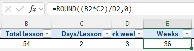
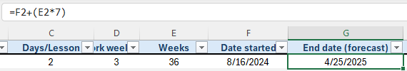
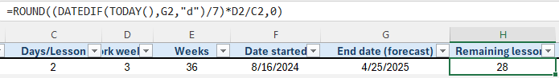
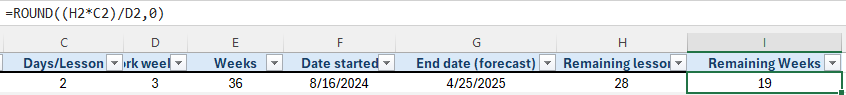
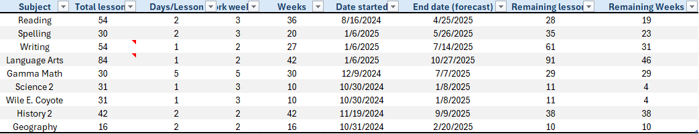

If you have ever had a moment of inspiration which sparked joy in your heart, you may understand why this small (tiny really) project motivated me to document it and write this report. As with any problem, one typically looks at the problem, studies it, then begins to break it down or work on solving it. However, I broke it down into simple logic, worked on the solution, then solved it within two hours. Though the problem is small, it has a great impact on predicting timeframes, which in turn aids in decision-making.

## The Problem

My husband, Mason, was looking at his spreadsheet where he keeps track of our daughter’s homeschooling lessons and dates. Yes, we homeschool her. I won’t go into it, but it has become necessary at this point. Anyway, we have her subjects listed out in a spreadsheet where Mason keeps track of them, eight subjects in total and each with their own respective number of lessons. The problem: Accurately forecasting the date of when the lessons will be ending so that we know when to purchase the next level, and calculating the remaining lessons and weeks until the end.

## The Breakdown

To break down this problem, I first needed to define the elements to consider. They are as follows:

1. We need to know how many weeks it would take to complete the level for each subject.  
2. We need to calculate/forecast the date on which each subject will end  
3. We need to know the remaining lessons and weeks from the current date

### The parameters

For the weeks, we would first need to find our parameters. Here’s how I broke it down:

* Total number of lessons (T)  
* Number of days per lesson (L)  
* Length of week in days worked (W)

I took a sample of what Mason already had to begin to simplify the calculation down to the most basic formula. The intent was to generalize it to the point where it could be scaled and manipulated to fit our needs. At first, I thought we would need to figure out the smallest whole number of weeks it takes to complete a lesson. This did not work, as it would not be generalized enough to apply to all subjects, since it involves more manual calculation on our part. The mistake I had made was thinking of each week in terms of full weeks, rather than the number of days in each week that are taken to work on each subject. Although I was able to calculate the correct number, it was more complicated than it needed to be. Here’s how that looked:  
<!-- > ***(Total lessons ÷ Work days) × Days per lesson*** -->
> $$\large{(Total\ lessons\ \div\ Work\ days)}\times{Days\ per\
 lesson}$$ 

###  Finalized formula

Of course, this isn’t a bad approach, but I wasn’t thinking of it in terms of conversion of Lessons \-\> Weeks. When I finally realized that it’s best to think about it in terms of converting units (thanks to Mason’s input, based on his experience in chemistry), it made much more sense:  
<!-- > ***(Lessons × Days per Lesson ) ÷ Days per Week \= Weeks*** -->
> $$\large{(Lessons\times Days\ per\ lesson)}\div {Days\ per\ week} = Weeks$$

What this broke down to is total lessons (T) times the days per lesson (D), divided by days per week (W):

> $$\large\frac{T\times D}{W}$$

## The Work

This is where the work in Excel began. I had broken it down into more manageable pieces and made it much easier to calculate. Below is a sample of what that looked like:

*Calculate the number of weeks to complete the subject.*

Here, you can see that I added the **ROUND()** function in order to account for any calculations that give me a decimal, rather than a whole number. Remember, we’re predicting/forecasting, not going for exact numbers. The next thing that I needed to add was a start date from which to calculate the forecasted end date. Simple enough to add the date to the next column. The next task was to calculate the end date based on the weeks that were calculated before.  
I found it to be simpler than I had imagined previously. A simple calculation of taking the start date, then adding the weeks multiplied by seven: *Start \+ (Weeks x 7\)*  
  
*Calculate the end date based on the start date and the number of weeks to completion.*

The next part of this problem was tricky since it isn’t as simple to calculate the remaining lessons in Excel. After a bit of research, I found the less often used **DATEDIF()** function, which takes two dates and returns the difference in whichever unit you indicate. For instance, DATEDIF(start\_date, end\_date, "d") would return the difference in days. One can extrapolate what *“m”* or *“y”* returns. This is well and good, however, we don’t need the result in days, we need it in weeks, so I divided it by seven. I found it best to work the original formula in reverse to find the remaining lessons. In other words:  
$$\large\frac{DateDiff\times W}{D}$$

Here is what that looks like: 

  
*Calculate remaining lessons by reversing the formula.*

Finally, I revisit the original formula to get the remaining weeks by using the remaining lessons as the total (T). To note for inquiring minds, there were instances where I needed to divide the number of lessons by the number of days per lesson. This is because there are two subjects that are based on pages, rather than lessons. In this case, it was for Writing and Language Arts, which we typically do two pages per lesson, twice a week. I added notes in the spreadsheet to indicate how we arrived at the lesson number to avoid confusion.  
  
*Calculate remaining weeks based on remaining lessons.*

## The Solution

After adding a column to indicate the subject and adding the rest of the subjects, I was successfully able to present a product that Mason could use to keep track of our daughter’s lessons and forecast when we need to purchase further materials. The result is below:  

*Final forecasting product*

For peace of mind, yes I stated that there were eight subjects, while there are nine present, however ***Science 2*** and ***Wile E. Coyote*** are both science.

## Conclusion

While this was not a huge undertaking, I truly enjoyed the journey of solving the problem of forecasting end dates and remaining lessons and weeks. Defining the problem is truly important in solving it. Breaking down the problem was where I had the most fun. Breaking things down into simple, easy to scale solutions is what motivated me to commit to the task. This is my favorite part of solving any problem, really. Then, I worked on the solution in Excel, which produced the product that will enable us to know when to purchase more materials to continue our daughter’s education. I hope this document has provided some insight into the way that I think and work on problems, and inspires you to reach out for further discussion.